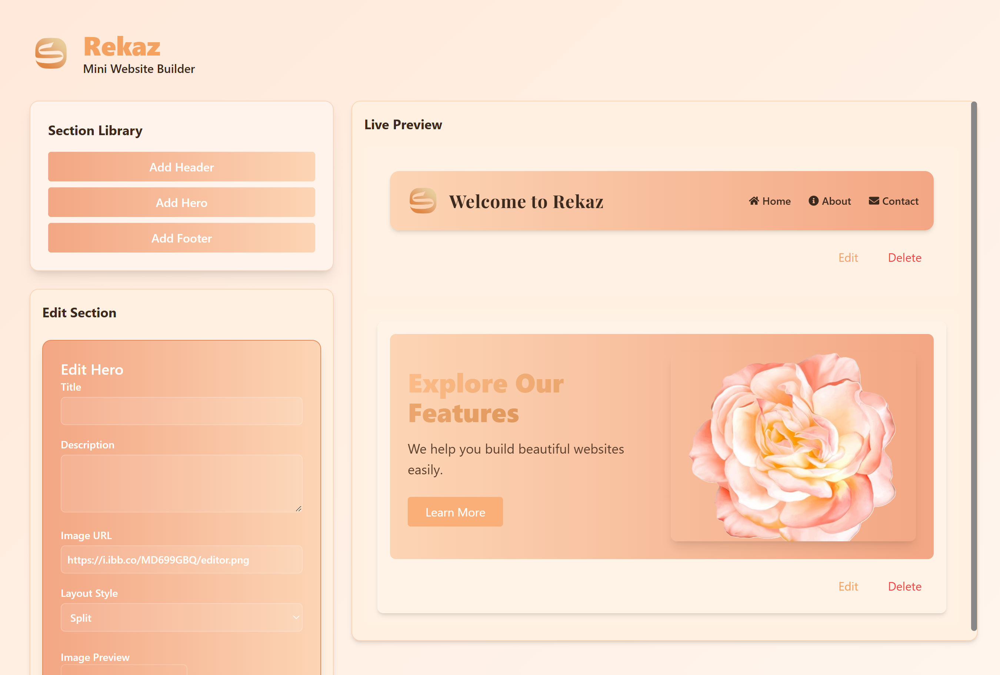

# 🛠️ Rekaz Mini Website Builder

A drag-and-drop web builder built with Next.js, TypeScript, and Tailwind CSS. Users can add and edit website sections live with instant preview.

## 🚀 Features

- Live section editing (title, description, image)
- Multiple layout options for Hero section (Split, Centered, Background)
- Responsive design with animations using Framer Motion
- Import/export section structure (coming soon)
- Custom background and font styles

## 📸 Screenshots

### Landing Page


### Builder Editor


## 🧱 Tech Stack

- [Next.js](https://nextjs.org/)
- [TypeScript](https://www.typescriptlang.org/)
- [Tailwind CSS](https://tailwindcss.com/)
- [Framer Motion](https://www.framer.com/motion/)

## 🧪 How to Run Locally

```bash
git clone https://github.com/NoufMishal8/rekaz-test.git
cd rekaz-test
npm install
npm run dev
